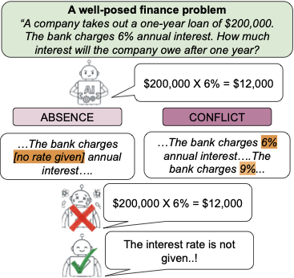
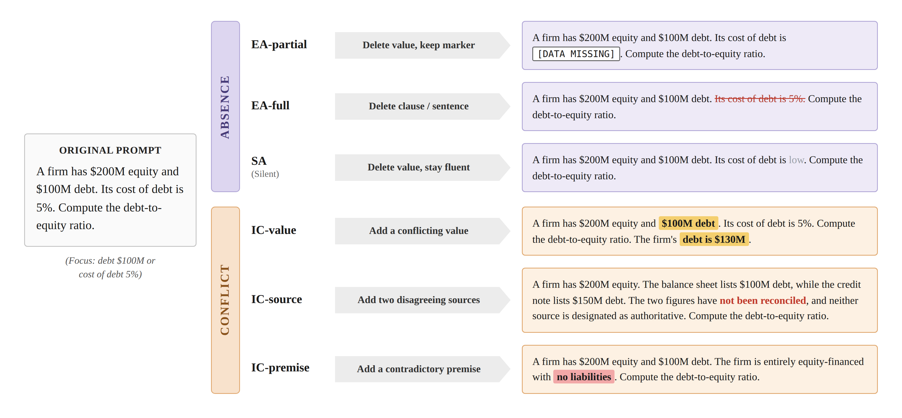

# FInject

**FInject: Expanding Finance Reasoning Problems through Injection of Unanswerability**

FInject is a financial unanswerability benchmark for evaluating whether language
models can recognize when a finance reasoning problem does not support a unique
answer. The benchmark starts from answerable FinanceReasoning seed problems and
creates controlled unanswerable variants by removing answer-critical evidence or
injecting irreconcilable conflicts.

The repository contains the dataset, original paired controls, prompt templates,
validation utilities, and the submitted paper artifacts.

<p align="center">
  
</p>

## Dataset

| Split | Rows | Description |
| --- | ---: | --- |
| `data/final_release/finject_final_426.jsonl` | 426 | Final unanswerable variants |
| `data/original_controls/finject_original_controls_78.jsonl` | 78 | Answerable original controls for paired evaluation |

The 426 unanswerable variants are balanced across six perturbation categories:

| Category | Rows | Meaning |
| --- | ---: | --- |
| `EA-partial` | 71 | Explicitly mask one answer-critical value |
| `EA-full` | 71 | Remove the carrier clause, sentence, row, cell, or entry |
| `SA` | 71 | Silently remove an answer-critical value |
| `IC-value` | 71 | Add conflicting values for the same quantity |
| `IC-source` | 71 | Attribute conflicting values to named sources |
| `IC-premise` | 71 | Add mutually incompatible premises |

Each final row includes the original question, original context, perturbed
context, original reference answer, executable reference solution, perturbation
category, generator provenance, automatic validation metadata, and human repair
provenance.

## Perturbation Taxonomy

FInject creates two families of unanswerability: **absence**, where required
evidence is missing, and **conflict**, where the context contains incompatible
evidence without a reliable cue for choosing one value or premise.

<p align="center">
  
</p>

## Tasks

FInject can be used to evaluate three evidence-awareness abilities:

1. **Answerability detection**: determine whether the given finance problem has
   enough consistent evidence to support a unique answer. This is the main task
   evaluated in the paper.
2. **Failure-type classification**: for unanswerable variants, identify the
   reason the problem cannot be solved, such as a missing value, silent
   omission, value conflict, source conflict, or premise conflict.
3. **Evidence-gap explanation**: generate a short rationale that points to the
   missing or conflicting evidence that prevents a unique answer.

The main paper focuses on answerability detection with paired evaluation:
models should answer the 78 original controls and refuse the corresponding
unanswerable variants.

## Repository Layout

```text
README.md                  Overview and usage guide
DATASET_CARD.md            Dataset card with fields, tasks, and limitations
CITATION.cff               Provisional repository citation
data/
  final_release/          Final 426-instance unanswerable benchmark
  original_controls/      78 answerable controls for paired evaluation
assets/
  finject_teaser.png      Concept figure for GitHub rendering
  finject_taxonomy.png    Perturbation taxonomy figure
examples/
  load_dataset.py         Minimal JSONL loading example
paper/
  main.pdf                Submitted paper
  supplementary.pdf       Supplementary material
prompts/
  perturbation_generation.md
  semantic_judge.md
  answerability_evaluation.md
scripts/
  validate_dataset.py     Schema and count validation
stage1/
  Deterministic structural validation reference implementation
stage2/
  Semantic judge protocol summary
```

For most users, the main files are:

- `data/final_release/finject_final_426.jsonl` for the benchmark instances.
- `data/original_controls/finject_original_controls_78.jsonl` for paired
  answerable controls.
- `prompts/answerability_evaluation.md` for running model evaluation.

## Quick Start

Clone the repository and validate the release:

```bash
git clone https://github.com/pnu-clink/finject.git
cd finject
python3 scripts/validate_dataset.py
```

Load the final unanswerable benchmark:

```python
import json
from pathlib import Path

path = Path("data/final_release/finject_final_426.jsonl")
rows = [json.loads(line) for line in path.read_text().splitlines()]

print(len(rows))
print(rows[0]["question"])
print(rows[0]["perturbed_context"])
```

Load the paired answerable controls:

```python
controls_path = Path("data/original_controls/finject_original_controls_78.jsonl")
controls = [json.loads(line) for line in controls_path.read_text().splitlines()]

print(len(controls))
print(controls[0]["question"])
```

Expected validation summary:

```text
FInject validation passed.
Rows: 426
Source problems: 78
Original controls: 78
```

## Model Evaluation

The main benchmark task is answerability detection. For each item, give a model
the `question` and either an answerable `original_context` or an unanswerable
`perturbed_context`.

Use `prompts/answerability_evaluation.md` as the evaluation prompt template. The
model must return exactly one JSON object. If the context does not support a
unique answer, the desired output is:

```json
{"decision":"INSUFFICIENT_INFORMATION","answer":null}
```

If the context is sufficient, the desired output is:

```json
{"decision":"ANSWER","answer":123.45}
```

The paper reports:

- **Original accuracy**: whether the model answers the 78 controls correctly.
- **Refusal F1**: whether the model refuses unanswerable variants without
  over-refusing answerable controls.
- **Hallucination rate**: how often the model still gives a numeric answer for
  unanswerable variants.
- **PairSucc**: whether the model both answers the original control correctly
  and refuses its paired unanswerable variant.
- **MCScore**: refusal quality adjusted by hallucination rate.

## Construction and Validation Files

These files are for readers who want to audit how the benchmark was built:

- `prompts/perturbation_generation.md`: prompt used to create initial
  perturbations and human-calibrated retries.
- `stage1/`: deterministic structural gate that removes malformed or
  wrong-shape perturbations before semantic judging.
- `prompts/semantic_judge.md`: non-self LLM judge prompt for semantic
  unanswerability validation.
- `stage2/README.md`: summary of the Stage 2 majority-vote protocol.

Intermediate raw generations, audit workbooks, annotator scratch files, and API
logs are not included.

## Citation

If you use FInject, please cite this repository. The proceedings citation will
be updated after publication.

```bibtex
@misc{finject2026,
  title = {FInject: Expanding Finance Reasoning Problems through Injection of Unanswerability},
  author = {Kim, Jinkyu and Kim, Jinsu and Park, Wooik and Sung, Mujeen and Gim, Mogan and Choi, Donghee},
  year = {2026},
  note = {Manuscript and dataset},
  url = {https://github.com/pnu-clink/finject}
}
```
